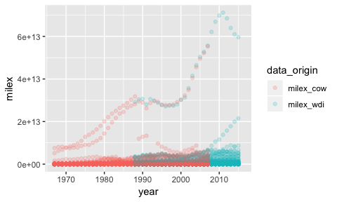
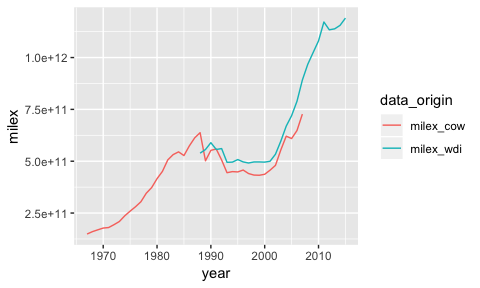

# Merging data
## The data
In today's workshop we will be using data on military expenditures from two publicly available sources: The World Bank Development Indicators (WDI), and the Correlates of War Project's (COW) National Material Capabilities Data Version 4.0 starting in 1914. The data has been cleaned after downloading it from the original sources.

The WDI data contains the following variables:

* `ccode`: COW country code (added using the `countrycode` package).
* `country`: Country name.
* `year`: Year.
* `milex_gdp`: Military expenditure as \% of GDP.
* `gdp`: GDP in current USD.

The COW data contains the following variables:

* `ccode`: COW country code.
* `year`: Year.
* `milex`: Military expenditure in current USD.

First, let's load the data and look at the temporal coverage.

```r
wdi <- read.csv("wdi_cleaned.csv")
summary(wdi$year)
```

```
##    Min. 1st Qu.  Median    Mean 3rd Qu.    Max. 
##    1967    1979    1992    1992    2004    2016
```

```r
cow <- read.csv("cow_cleaned.csv")
summary(cow$year)
```

```
##    Min. 1st Qu.  Median    Mean 3rd Qu.    Max. 
##    1914    1956    1977    1972    1993    2007
```

**Exercise 1** Suppose, we are interested in absolute military expenditures. Add a new variable to the WDI data set called `milex` that codes military expenditures in USD using functions from the `dplyr` package and piping.


```
##   ccode     country year milex_gdp        gdp milex
## 1   700 Afghanistan 1967        NA 1673333419    NA
## 2   700 Afghanistan 1968        NA 1373333367    NA
## 3   700 Afghanistan 1969        NA 1408888923    NA
## 4   700 Afghanistan 1970        NA 1748886596    NA
## 5   700 Afghanistan 1971        NA 1831108972    NA
## 6   700 Afghanistan 1972        NA 1595555476    NA
```


## A primer on data merging using base `R` functions
In principle, we can merge data using the `cbind()` ("column bind") and `rbind()` ("row bind") functions, that we are already familiar with.

```r
vec1 <- c(1, 2, 3)
vec2 <- c("a", "a", "b")
cbind(vec1, vec2)
```

```
##      vec1 vec2
## [1,] "1"  "a" 
## [2,] "2"  "a" 
## [3,] "3"  "b"
```

```r
rbind(vec1, vec2)
```

```
##      [,1] [,2] [,3]
## vec1 "1"  "2"  "3" 
## vec2 "a"  "a"  "b"
```

However, this requires the data to align in its dimensions. In addition, for `cbind()` the ordering of the rows has to be the exact same to achieve correct merging; for `rbind()` the ordering of the columns has to be equal to achieve the right output.

```r
dat1 <- cbind(vec1, vec2)
vec3 <- c(T, F, T, T)
cbind(dat1, vec3) # The fourth observation in vec3 is omitted
```

```
## Warning in cbind(dat1, vec3): number of rows of result is not a multiple of
## vector length (arg 2)
```

```
##      vec1 vec2 vec3   
## [1,] "1"  "a"  "TRUE" 
## [2,] "2"  "a"  "FALSE"
## [3,] "3"  "b"  "TRUE"
```

```r
obs <- c("c", 4)
rbind(dat1, obs)
```

```
##     vec1 vec2
##     "1"  "a" 
##     "2"  "a" 
##     "3"  "b" 
## obs "c"  "4"
```

As a side note: The `bind_rows()` function in the `dplyr` package is the smart cousin of `rbind()`. Given that two dataframes have an equal number of columns, it can merge them based on the variable name; the ordering of the columns does not matter.

## Using dplyr for merging
Luckily, the `dplyr` package in `R` contains a number of functions that allow us to merge data in "smarter" ways. Please refer to the [Data Wrangling Cheat Sheet](https://www.rstudio.com/wp-content/uploads/2015/02/data-wrangling-cheatsheet.pdf) for an overview of the functions `dplyr` has available.

Suppose, we have two data frames: `x` (here WDI) and `y` (here COW). The basic syntax for data merging with `dplyr` is the following:

`output <- join(A, B, by = "variable")`

We will focus on the following four join functions:

* `full_join()`: Join data from `x` and `y` upon retaining all rows and values. This is the maximum join possible. Neither `x` nor `y` is the "master."
* `inner_join()`: Join only those rows that appear in both `x` and `y`. Neither `x` nor `y` is the "master."
* `left_join()`: Join only those rows from `y` that appear in `x`, retaining all data in `x`. Here, `x` is the "master."
* `right_join()`: Join only those tows from `x` that appear in `y`, retaining all data in `y`. Here, `y` is the "master."

### `full_join()`
Suppose we wanted to keep the maximum amount of data in our new merged data set, we would use the `full_join()` function to merge the WDI and COW data.

```r
full_wrong <- full_join(wdi, cow, by = "ccode")
```

Take a look at the data frame! There are a couple of things to notice:

1. There are a number of duplicate column names in our data. `dplyr` automatically added a suffix to those instances; `x` for the WDI  data (the first data set we passed to the function) and `y` for the COW data (the second data set passed to the function). We will rename these variables later on to keep track from which data set they originate.
2. We have over 500,000 observations even though our original datasets `wdi` and `cow` only have approximately 10,000 observations each. Why do you think this is the case? Do you notice something weird about the `year` variable(s)?

The reason for the high number of observations is that we asked `dplyr` to join the data sets based on the `ccode` variable only. This matches each observation in dataset `x` to each observation in dataset `y` as long as they have the same `ccode`. However, the rows in our data are not uniquely identified by the ccode variable. Since `wdi` and `cow` are panel data sets, each observation is uniquely identified by the combination of country code and year. We need to pass this information to the `full_join()` function to correctly match up the observations in our data.

In reality, `full_join()` and the other join functions from `dplyr` are smarter than that and will often identify which columns to match on based on duplicate column names. However, in our particular case, we run into problems because we have more duplicate column names that unique identifiers for the data; see the message that `R` outputs when running the command without specifying by which variables to merge.

```r
full_alsowrong <- full_join(wdi, cow)
```

```
## Joining, by = c("ccode", "year", "milex")
```

Now, before we do the correct full join, lets also rename the variables in our original data set to keep track of the data set from which the indicator originates. In the next session, we will learn how to do this with string operations, but for now, lets use dplyr's `select()` function.


```r
names(wdi)
```

```
## [1] "ccode"     "country"   "year"      "milex_gdp" "gdp"       "milex"
```

```r
wdi <- wdi %>%
  select(ccode:year,
         milex_gdp_wdi = milex_gdp,
         gdp_wdi = gdp,
         milex_wdi = milex,
         everything())

names(cow)
```

```
## [1] "ccode" "year"  "milex"
```

```r
cow <- cow %>%
  select(ccode:year,
         milex_cow = milex)
```

We are ready to join! Notice that we use a vector to specify multiple inputs that define our unique observations.

```r
merged_full <- full_join(wdi, cow, by = c("ccode", "year")) %>% 
  arrange(ccode, year)
head(merged_full)
```

```
##   ccode country year milex_gdp_wdi gdp_wdi milex_wdi    milex_cow
## 1     2    <NA> 1914            NA      NA        NA 2.532050e+10
## 2     2    <NA> 1915            NA      NA        NA 2.576480e+10
## 3     2    <NA> 1916            NA      NA        NA 2.774210e+10
## 4     2    <NA> 1917            NA      NA        NA 6.585840e+10
## 5     2    <NA> 1918            NA      NA        NA 7.014226e+11
## 6     2    <NA> 1919            NA      NA        NA 1.121780e+12
```

```r
nrow(merged_full)
```

```
## [1] 13698
```

### `inner_join()`
Suppose, instead of retaining as much data as possible, we only wanted to keep data for which we have observations in both data sets. Note that this merging is only done based on the variables that we specify to uniquely identify each observation. `NA` values in all other columns are retained. Please refer to the *Data Wrangling Cheat Sheet* for methods that will select based on matching values beyond the unique identifiers (see for example `intersect()` and `setdiff()`).

```r
merged_inner <- inner_join(wdi, cow, by = c("ccode", "year")) %>% 
  arrange(ccode, year)
head(merged_inner)
```

```
##   ccode       country year milex_gdp_wdi      gdp_wdi milex_wdi
## 1     2 United States 1967            NA 8.617000e+11        NA
## 2     2 United States 1968            NA 9.425000e+11        NA
## 3     2 United States 1969            NA 1.019900e+12        NA
## 4     2 United States 1970            NA 1.075884e+12        NA
## 5     2 United States 1971            NA 1.167770e+12        NA
## 6     2 United States 1972            NA 1.282449e+12        NA
##      milex_cow
## 1 7.544800e+12
## 2 8.073200e+12
## 3 8.144600e+12
## 4 7.782701e+12
## 5 7.486200e+12
## 6 7.763900e+12
```

```r
nrow(merged_inner)
```

```
## [1] 6614
```

### `left_join()` and `right_join()`
Suppose, we had an existing master data set and wanted to add data to this master without adding new rows, just new columns. This could for example be the case if we had a spcific time frame that we wanted to study, and only want to merge data which matches this time frame.[^1] 

[^1]: Another example is the case when we have a master data set that reflects the system membership of all countries which have COW country codes. We do not want to add observations from the other data sets that do not have COW country codes (for example data from Greenland or Puerto Rico). This example is for illustration only. When cleaning the WDI data, I have already removed the observations that do not have a COW code (such as Greenland or Puerto Rico).

Here, suppose we wanted to make the WDI our master data set and merge data from the COW data onto this master. The WDI has a much smaller temporal coverage than the COW. For the sake of saving memory space, we only want the temporal coverage of the WDI reflected in the merged data. We can show that the WDI and the merged data frame have the same number of observations (rows).

```r
merged_left <- left_join(wdi, cow, by = c("ccode", "year"))
nrow(wdi) == nrow(merged_left)
```

```
## [1] TRUE
```

**Exercise 2** How would you achieve the exact same result using the `right_join()` function?

```
## [1] TRUE
```

# Data re-shaping with `tidyr`
Another important task in data management is data re-shaping. Often, data does not come in the format that we need for data merging, data visualization, statistical analysis, or vectorized programming. In general, we want data in the following format:

1. Each variable forms a column.
2. Each observation forms a row.[^2]
3. For panel data, the unit (e.g. country) and time (e.g. year) identifier form columns.

[^2]: Hadley Wickham (2014, "Tidy Data" in *Journal of Statistical Analysis*) adds another condition, namely that "Each type of observational unit forms a table." We will not go into this here, but I can highly recommend you read Wickham's piece if you want to dive deeper into tidying data.

The `tidyr` package offers two main functions for data reshaping:

* `gather()`: Shaping data from wide to long.
* `spread()`: Shaping data from long to wide.

## Wide versus long data
For **wide** data formats, each unit's responses are in a single row. For example:

| Country | Area | Pop1990 | Pop1991 |
|---------|------|---------|---------|
| A       | 300  | 56      | 58      |
| B       | 150  | 40      | 45      |

For **long** data formats, each row denotes the observation of a unit at a given point in time. For example:

| Country | Year | Area | Pop |
|---------|------|------|-----|
| A       | 1990 | 300  | 56  |
| A       | 1991 | 300  | 58  |
| B       | 1990 | 150  | 40  |
| B       | 1991 | 150  | 45  |


## `gather()`
We use the `gather()` function to reshape data from wide to long. In general, the syntax of the data is as follows:

`new_df <- gather(old_df, key, value, columns to gather)`

We will be working with the `merged_left` data set. Suppose, we wanted to have a single column for military expenditures, and another column identifying the data set that the data comes from.

Gathering the military expenditure variables in this way will result in duplicate rows for each country-year. Whether or not this data format is desirable depends on the intended use for the data. Most statistical analysis methods require the data to have a single row per observation (for example country-year). However, some data visualization methods fare better when each concept (for example the variable `milex`) is captured in a single column with additional columns specifying supplementary attributes of the observation (see below).

Below, note that since `tidyr` and `dplyr` are sibling packages from the "tidyverse," we can use them seamlessly in the same pipe (here using `arrange()` from `dplyr` to illustrate the duplicate observations per country-year).

```r
library(tidyr)
```

```
## Warning: package 'tidyr' was built under R version 3.4.4
```

```r
merged_long <- merged_left %>%
  gather(data_origin, # name for categorical name indicator
         milex, # values
         milex_wdi:milex_cow) %>% # variables to be reshaped
  arrange(ccode, year) 

# Creating averages by year
merged_long_averages <- merged_long %>%
  group_by(year, data_origin) %>%
  filter(!is.na(milex)) %>%
  summarize(milex = mean(milex))
```

We can use this format to plot the miliary expenditure for each of the data sets over time. Here, I use the `ggplot2` package (also from the "tidyverse") to show how to create over-time plots that use the properties of "tidy" data, namely the fact that a specific feature is represented with a single column (here `milex`), with additional columns specifying supplementary properties of this feature (here `data_origin`). Please note that these are both very basic graphs. For more customization of `ggplot2` graphs, see the [introductory workshop on data visualization with  `ggplot2`](https://github.com/thereseanders/Workshop-Intro-to-ggplot2).

```r
library(ggplot2)
ggplot(merged_long, 
       aes(x = year, y = milex, color = data_origin)) +
  geom_point(alpha = 0.2)
```

<!-- -->

```r
ggplot(merged_long_averages, 
       aes(x = year, y = milex, color = data_origin)) +
  geom_line()
```

<!-- -->

## `spread()`
Suppose we wanted to revert our operation (or generall shape data from a long to a wide format), we can use `tidyr`'s `spread()` function. The syntax is similar to `gather()`.

`new_df <- spread(old_df, key, value)`,

where `key` refers to the colum which contains the values that are to be converted to column names and `value` specifies the column that contains the value which is to be stored in the newly created columns.


```r
head(merged_long, 3)
```

```
##   ccode       country year milex_gdp_wdi   gdp_wdi data_origin      milex
## 1     2 United States 1967            NA 8.617e+11   milex_wdi         NA
## 2     2 United States 1967            NA 8.617e+11   milex_cow 7.5448e+12
## 3     2 United States 1968            NA 9.425e+11   milex_wdi         NA
```

```r
merged_wide <- spread(merged_long, data_origin, milex) 
```

# Sources
Correlates of War (COW) National Material Capabilities Data Version 4.0. http://www.correlatesofwar.org/data-sets/downloadable-files/national-material-capabilities-v4-0 (accessed Oct 2016).

The World Bank: World Development Indicators. https://datacatalog.worldbank.org/dataset/world-development-indicators (accessed Oct 2016).
(accessed Oct 2016).
